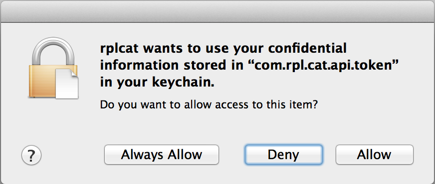
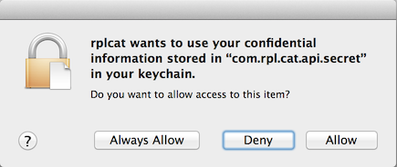

# Keychain access in Cocoa

When storing secure information like passwords or API tokens in your Mac application, you want to use the Keychain. The Keychain is a built in mechanism for securing information specific to applications and users in OSX. 

The problem? It really isn't clear how or when you should store items in the keychain and what the implications of those decisions are. Over the years Apple's documentation has improved but the workflows it describes still focus only on passwords.

> See also: [OS X Keychain Services Tasks](https://developer.apple.com/library/mac/documentation/security/conceptual/keychainServConcepts/03tasks/tasks.html)  in Apple's Keychain Services Programming Guide

## Dialogs

### When you access a keychain item you see a dialog

### When your application changes, you see a dialog
### Differences in Keychain access on iOS and OSX
### Signing your application

### Working with the keychain

    - (void)setKeychainData:(NSString *)data forService:(NSString *)service andAccount:(NSString *)account
    {
        OSStatus err;
        SecKeychainItemRef item = nil;
        const char *dataUTF8 = [data UTF8String];
        const char *serviceUTF8 = [service UTF8String];
        const char *accountUTF8 = [account UTF8String];
        
        assert(strlen(serviceUTF8) <= 0xffffffff);
        assert(strlen(accountUTF8) <= 0xffffffff);
        assert(strlen(dataUTF8) <= 0xffffffff);
        
        err = SecKeychainFindGenericPassword(NULL, // use the default keychain
                                             (UInt32)strlen(serviceUTF8),
                                             serviceUTF8,
                                             (UInt32)strlen(accountUTF8),
                                             accountUTF8,
                                             NULL,
                                             NULL,
                                             &item);
        
        
        // Do not return from this error as a common outcome is "not found"
        if (err != noErr) {
            NSLog(@"%@", SecCopyErrorMessageString(err, NULL));
        }

        if (item) {
            err = SecKeychainItemModifyContent(item,
                                               NULL,
                                               (UInt32)strlen(dataUTF8),
                                               dataUTF8);
        }
        else {
            err = SecKeychainAddGenericPassword(NULL, // use the default keychain
                                                (UInt32)strlen(serviceUTF8),
                                                serviceUTF8,
                                                (UInt32)strlen(accountUTF8),
                                                accountUTF8,
                                                (UInt32)strlen(dataUTF8),
                                                dataUTF8,
                                                &item);
        }
        
        if (item) CFRelease(item);
        
        if (err != noErr) {
            NSLog(@"%@", SecCopyErrorMessageString(err, NULL));
            return;
        }
    }

...

    - (NSString *)getKeychainData:(NSString *)service andAccount:(NSString *)account
    {
        OSStatus err;
        SecKeychainItemRef item = nil;
        const char *serviceUTF8 = [service UTF8String];
        const char *accountUTF8 = [account UTF8String];
        
        assert(strlen(serviceUTF8) <= 0xffffffff);
        assert(strlen(accountUTF8) <= 0xffffffff);
        
        char *data = nil;
        UInt32 dataLength = 0;

        err = SecKeychainFindGenericPassword(NULL, // use the default keychain
                                             (UInt32)strlen(serviceUTF8),
                                             serviceUTF8,
                                             (UInt32)strlen(accountUTF8),
                                             accountUTF8,
                                             &dataLength,
                                             (void **)&data,
                                             &item);

        if (item) CFRelease(item);

        if (err != noErr) {
            NSLog(@"%@", SecCopyErrorMessageString(err, NULL));
            
            return nil;
        }
        
        NSString *dataString = [[NSString alloc] initWithBytes:data length:dataLength encoding: NSUTF8StringEncoding];
        SecKeychainItemFreeContent(NULL, data);
        
        return dataString;
    }

...

    - (void)deleteKeychainData:(NSString *)service andAccount:(NSString *)account
    {
        OSStatus err;
        SecKeychainItemRef item = nil;
        const char *serviceUTF8 = [service UTF8String];
        const char *accountUTF8 = [account UTF8String];
        
        assert(strlen(serviceUTF8) <= 0xffffffff);
        assert(strlen(accountUTF8) <= 0xffffffff);
        
        err = SecKeychainFindGenericPassword(NULL, // use the default keychain
                                             (UInt32)strlen(serviceUTF8),
                                             serviceUTF8,
                                             (UInt32)strlen(accountUTF8),
                                             accountUTF8,
                                             NULL,
                                             NULL,
                                             &item);
        
        
        if (err != noErr) {
            NSLog(@"%@", SecCopyErrorMessageString(err, NULL));
            return;
        }
        
        if (item) {
            err = SecKeychainItemDelete(item);
        }

        if (err != noErr) {
            NSLog(@"%@", SecCopyErrorMessageString(err, NULL));
            return;
        }
        
        if (item) CFRelease(item);
    }

### Storing items in the keychain based on different service names
### Storing items in the keychain based on account names
### Storing data in the keychain
### When to suggest passwords and when to remove entries

## Advanced

* Granting access to keychain items from other applications
* Disabling keychain popups for server applications