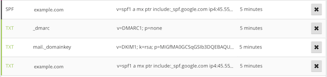

# Server Security

This is very incomplete and covers some of the basics. These assume a single server setup, some of the recommendations would change considerably if you could delegate to other servers in your cluster.

## Securing your server

Create a new server and set your SSH key. Then `ssh root@IP_ADDRESS`

### Root Password

First things, first change your root password:

    passwd

Set a password generated from 1Password.

### Updates and automatic updates:

You should upgrade right now and keep things upgraded:

    apt-get update
    apt-get upgrade
    apt-get install unattended-upgrades

Next edit `/etc/apt/apt.conf.d/10periodic` so it looks like:

    APT::Periodic::Update-Package-Lists "1";
    APT::Periodic::Download-Upgradeable-Packages "1";
    APT::Periodic::AutocleanInterval "7";
    APT::Periodic::Unattended-Upgrade "1";

### Creating a user

Now we want a user. We'll call this user `deploy`:

    useradd -D -s /bin/bash
    useradd deploy
    mkdir /home/deploy
    mkdir /home/deploy/.ssh
    chmod 700 /home/deploy/.ssh

Now that you have a user you want to setup an authorized key saying that your computer is allowed to login to the server without using a password. This is actually much safer than using a password because passwords can be guessed. Keys are much longer and encrypt all of you communications between your machine and the server.

    nano /home/deploy/.ssh/authorized_keys

The `nano` editor will open and you need to get some information from your local computer. Open another tab or another terminal window and in the new Terminal type:

    cat ~/.ssh/id_rsa.pub

You should see something like:

    $ cat ~/.ssh/id_rsa.pub
    ssh-rsa ssflsjdjsfljslkdfjyUvMIvhJUYs7nIaiLBnUcs03XuOeHiw1JGh1M/ovbKc9YO4SJsl9CYxpyDeh9jSyvdNhNdeUSg7PBSSyAYpVXeK6WXN9LnqKOWRu8n5rXGNSycM2tenaADiS/xtMkHmIFYOE/QFQF+AmgdklfjsdfjlskjdflksjfdlkjslkjsIP/gxSsEDzOGSIxYqJwpCzV+/nwub72ElzVcW9EJu2HJHGYIUHK80980989089089089090OyFubRb7+V6Db4xc+x2HirdyMW7hZceDfTpB0xX1GXd4PYZ023gfvNkGbIj/aOSDeJtDIJyQhzCbIXY+CiLkU556e0rg2Nw== yourname@yourcomputer.local

Note that this is your *public* key. You also have a *private* key which you should not give away ever (it is in the file id_rsa without the `.pub` extension).

Copy the contents (including `ssh-rsa` and `yourname@yourcomputer.local`) and paste it back in the `nano` window in the other terminal. Once pasted, click `Ctrl+X` type "Y" for "yes" and hit enter.

Now we need to lock down that file so nobody can change it (and add their own keys). Once we have changed the mode so it is only readable, we will change the owner to our new `deploy` user:

    chmod 400 /home/deploy/.ssh/authorized_keys
    chown deploy:deploy /home/deploy -R

#### Super user access (optional)

We'll give the user a password which we will need when doing important things.

    passwd deploy

Next we need to change how the `sudo` command works. The `sudo` command is short for "super-user do" and lets users run commands as if they were the `root` (most powerful) user. To change this we'll use a command called `visudo`. This command opens an editor called `vi` which works a little differently than the editors you are used to. Instead we'll force it to use `nano`:

    EDITOR=nano visudo

Once open you should see a lot of commands and you want to comment some of them out:

    %admin ALL=(ALL) ALL

and

    %sudo ALL=(ALL) ALL

We are going to comment these lines out by adding a "# " to the start of the lines:

    # %admin ALL=(ALL) ALL

and

    # %sudo ALL=(ALL) ALL

Next we'll add the line:

    deploy ALL=(ALL) ALL

This says, as long as we are logged in and know the password we can run ALL commands as the superuser.

> Technically we shouldn't need this for our server as everything will be setup. Giving users `sudo` is very serious. If they have super user privileges they can change anything about the server. Sometimes when setting up a server you'll see people use `NOPASSWD:ALL` indicating that you don't even need a password. This is very dangerous and is usually just a sign of laziness. For us, it is good to have some access so that we can switch to the super user later.

Finally we want to be able to use SSH as this user:

    groupadd ssh-user
    usermod -a -G ssh-user deploy

### Local mail and smtp via Postfix

These instructions are taken directly from [https://www.digitalocean.com/community/tutorials/how-to-install-and-configure-postfix-as-a-send-only-smtp-server-on-ubuntu-14-04](https://www.digitalocean.com/community/tutorials/how-to-install-and-configure-postfix-as-a-send-only-smtp-server-on-ubuntu-14-04). You'll want to note your Droplet's hostname:

    hostname -f

On Ubuntu the easiest way to get mail up an running is to install `mailutils`:

    apt-get install mailutils

When prompted for the *Postfix Configuration* choose `Internet Site` and choose `OK`. Next you will be asked for the *System Mail Name* which should be the same as your droplet's hostname.

Next you'll need to edit `/etc/postfix/main.cf`. Change

    inet_interfaces = all
    
To:

    inet_interfaces = localhost
    
Then restart postfix:

    service postfix restart
    
Test that sending mail works:

    echo "This is the body" | mail -s "The subject" user@example.com
    
To forward system mail you'll need to add an alias to `/etc/aliases`. You can add aliases for existing users and non-existing users:

    # See man 5 aliases for format
    postmaster:    root
    root:          forward@example.com
    ops:           forward@example.com
    
Save the file and enable the aliases:

    newaliases

Test that sending mail works:

    echo "This is the body" | mail -s "The subject" root

> You can whitelist emails from the domain in your email client (so they are not sent to spam) or you can correctly identify the server using a PTR record, SPF record and by using OpenDKIM

* [https://www.digitalocean.com/community/tutorials/how-to-install-and-configure-postfix-as-a-send-only-smtp-server-on-ubuntu-14-04](https://www.digitalocean.com/community/tutorials/how-to-install-and-configure-postfix-as-a-send-only-smtp-server-on-ubuntu-14-04)
* [https://www.digitalocean.com/community/tutorials/how-to-use-an-spf-record-to-prevent-spoofing-improve-e-mail-reliability](https://www.digitalocean.com/community/tutorials/how-to-use-an-spf-record-to-prevent-spoofing-improve-e-mail-reliability)
* [https://www.digitalocean.com/community/tutorials/how-to-install-and-configure-dkim-with-postfix-on-debian-wheezy](https://www.digitalocean.com/community/tutorials/how-to-install-and-configure-dkim-with-postfix-on-debian-wheezy)

Make sure the PTR record (the name of your droplet) matches your fully qualified domain name (FQDN). For example, if you domain is example.com, then your mailing host above should be example.com and your droplet should be called example.com. Your PTR record is managed by your hosting provider (not your DNS).

Then add an SPF record to your DNS:

    SPF @ "v=spf1 a mx ptr include:_spf.google.com ip4:1.2.3.4 -all"

This says that email sent from your A record, MX record, or PTR and from google.com should be allowed. It also allows your primary IP as a sender. With the setup described in this section, you could actually remove the MX (it isn't sending directly).

Some DNS companies don't allow a specific "SPF" record. If you can add both an SPF record and a TXT record with the same value.

For OpenDKIM, start by installing the package:

    apt-get install opendkim opendkim-tools 
    
Add the following options to `/etc/opendkim.conf`:

    AutoRestart             Yes
    AutoRestartRate         10/1h
    SyslogSuccess           Yes
    LogWhy                  Yes

    Canonicalization        relaxed/simple

    ExternalIgnoreList      refile:/etc/opendkim/TrustedHosts
    InternalHosts           refile:/etc/opendkim/TrustedHosts
    KeyTable                refile:/etc/opendkim/KeyTable
    SigningTable            refile:/etc/opendkim/SigningTable

    Mode                    sv
    PidFile                 /var/run/opendkim/opendkim.pid
    SignatureAlgorithm      rsa-sha256

    UserID                  opendkim:opendkim

    Socket                  inet:12301@localhost

Add the milter by adding the following to `/etc/default/opendkim`:

    SOCKET="inet:12301@localhost"

Add to `/etc/postfix/main.cf`:    
    
    milter_protocol = 6
    milter_default_action = accept
    smtpd_milters = inet:localhost:12301
    non_smtpd_milters = inet:localhost:12301

    
Specify Trusted hosts in `/etc/opendkim/TrustedHosts`:

    127.0.0.1
    localhost
    192.168.0.1/24

    *.example.com
    
In `/etc/opendkim/KeyTable`:

    mail._domainkey.example.com example.com:mail:/etc/opendkim/keys/example.com/mail.private
    
In `/etc/opendkim/SigningTable`:

    *@example.com mail._domainkey.example.com    

Make a key dir and key:

    mkdir -p /etc/opendkim/keys/example.com
    cd /etc/opendkim/keys/example.com
    opendkim-genkey -s mail -d example.com
    chown opendkim:opendkim mail.private
    cat mail.txt
    
Copy the `p` value and create a TXT DNS entry. Domain:
    
    TXT mail._domainkey "v=DKIM1; k=rsa; p=YOUR_P_VALUE_HERE"

Restart:

    service postfix restart
    service opendkim restart

You can test the setup by sending mails at [http://www.mail-tester.com](http://www.mail-tester.com).

If you are sending via a third party domain you can explore ATPSDomains. Or you can set them up manually. For example Mandrill allows customization: https://mandrill.zendesk.com/hc/en-us/articles/205582387-How-do-I-set-up-sending-domains-

Once you have completed your SPF and DKIM setup and have successfully tested them, you can add a `_dmarc` host (another TXT record) that helps ensure your SPF and DKIM are respected.

    TXT _dmarc "v=DMARC1; p=none"

For example, on Cloudflare you might have entries like this:

### Watching the logs

Next get logwatch:

    apt-get install logwatch

Make a cache dir:

    mkdir /var/cache/logwatch
 
Make a default conf:

    cp /usr/share/logwatch/default.conf/logwatch.conf /etc/logwatch/conf/

If you want to send email directly to an alternate user you can edit the cron configuration `/etc/cron.daily/00logwatch`:

    /usr/sbin/logwatch --mailto jeffrafter@gmail.com
 
You can test this by executing the cron manually:

    /etc/cron.daily/00logwatch

### Autoban malicious users

If someone is trying to do something bad and you can detect it, you should kick them out (or slow them down):

    apt-get install fail2ban

Create `/etc/fail2ban/jail.local`:

    [DEFAULT]
    ignoreip  = 127.0.0.1
    bantime   = 86400
    destemail = jeffrafter@gmail.com
    banaction = iptables-multiport
    action    = %(action_)s

    # JAILS
    [ssh]
    enabled   = true
    maxretry  = 3

    [pam-generic]
    enabled   = true
    banaction = iptables-allports

    [ssh-ddos]
    enabled   = true

    [apache]
    enabled = true

    [nginx-http-auth]
    enabled = true

    [postfix]
    enabled  = true
    maxretry = 1

    [dovecot-pop3imap]
    enabled = true
    filter = dovecot-pop3imap
    action = iptables-multiport[name=dovecot-pop3imap, port="pop3,imap,993,995", protocol=tcp]
    logpath = /var/log/mail.log
    maxretry = 20
    findtime = 1200
    bantime = 1200

### Rootkits

In addition to fail2ban you'll want to check for rootkits:

    apt-get install lynis
    apt-get install rkhunter

### Securing SSH

You'll need to secure your `/etc/ssh/sshd_config`:

    # Package generated configuration file
    # See the sshd_config(5) manpage for details

    # What ports, IPs and protocols we listen for
    Port 22

    # Never use protocol 1
    Protocol 2

    # HostKeys for protocol version 2
    HostKey /etc/ssh/ssh_host_rsa_key
    HostKey /etc/ssh/ssh_host_ed25519_key

    # Secure defaults; we do not support older encryption. We must support Kex algorithms
    # that rely on the moduli (diffie-hellman-group-exchange-sha256) because OSX won't use
    # curve25519 by default (yet)
    KexAlgorithms curve25519-sha256@libssh.org,diffie-hellman-group-exchange-sha256
    Ciphers chacha20-poly1305@openssh.com,aes256-gcm@openssh.com,aes128-gcm@openssh.com,aes256-ctr,aes192-ctr,aes128-ctr
    MACs hmac-sha2-512-etm@openssh.com,hmac-sha2-256-etm@openssh.com,hmac-ripemd160-etm@openssh.com,umac-128-etm@openssh.com

    # Privilege Separation is turned on for security
    UsePrivilegeSeparation yes

    # Lifetime and size of ephemeral version 1 server key
    KeyRegenerationInterval 3600
    ServerKeyBits 2048

    # Causes rekeys for forward secrecy intra-session, may affect large uploads or downloads
    RekeyLimit 256M

    # Logging
    SyslogFacility AUTH
    LogLevel INFO

    # Authentication:
    LoginGraceTime 30
    MaxAuthTries 3
    PermitRootLogin no
    StrictModes yes

    # Force logout idle sessions (15 minutes)
    ClientAliveInterval 900
    ClientAliveCountMax 0

    # Don't read the user's ~/.rhosts and ~/.shosts files
    IgnoreRhosts yes
    # For this to work you will also need host keys in /etc/ssh_known_hosts
    RhostsRSAAuthentication no
    # similar for protocol version 2
    HostbasedAuthentication no
    # Uncomment if you don't trust ~/.ssh/known_hosts for RhostsRSAAuthentication
    #IgnoreUserKnownHosts yes

    # To enable empty passwords, change to yes (NOT RECOMMENDED)
    PermitEmptyPasswords no

    # Change to yes to enable challenge-response passwords (beware issues with
    # some PAM modules and threads)
    ChallengeResponseAuthentication no

    # Change to no to disable tunnelled clear text passwords
    PasswordAuthentication no

    # Turn off other forms of authentication
    RSAAuthentication no # Do I need this?
    PubkeyAuthentication yes

    # We are not allowing tunneling
    AllowTcpForwarding no
    GatewayPorts no
    PermitTunnel no

    # Not using X11
    X11Forwarding no
    X11DisplayOffset 10
    PrintMotd no
    PrintLastLog yes
    TCPKeepAlive yes
    #UseLogin no

    # Limit the number of concurrent unauthenticated sessions
    MaxStartups 2
    MaxSessions 3

    # Legal warning to tell people to stay out
    Banner /etc/issue.net

    # Don't allow client to pass env, even locale environment variables
    PermitUserEnvironment no

    Subsystem sftp /usr/lib/openssh/sftp-server

    # Set this to 'yes' to enable PAM authentication, account processing,
    # and session processing. If this is enabled, PAM authentication will
    # be allowed through the ChallengeResponseAuthentication and
    # PasswordAuthentication.  Depending on your PAM configuration,
    # PAM authentication via ChallengeResponseAuthentication may bypass
    # the setting of "PermitRootLogin without-password".
    # If you just want the PAM account and session checks to run without
    # PAM authentication, then enable this but set PasswordAuthentication
    # and ChallengeResponseAuthentication to 'no'.
    UsePAM yes

    # Take DNS out of the equation
    UseDNS no

    # Only allow specific users to ssh.
    # Add the group `sudo groupadd ssh-user`
    # Then add a user to the group `sudo usermod -a -G ssh-user <username>`
    AllowGroups ssh-user

Fix your moduli. If `/etc/ssh/moduli` exists:

    awk '$5 > 2000' /etc/ssh/moduli > "${HOME}/moduli"
    wc -l "${HOME}/moduli" # make sure there is something left
    mv "${HOME}/moduli" /etc/ssh/moduli 

Otherwise create it (takes about 10 minutes on a Digital Ocean 5$/mo box):

    ssh-keygen -G "${HOME}/moduli" -b 4096
    ssh-keygen -T /etc/ssh/moduli -f "${HOME}/moduli"
    rm "${HOME}/moduli"

Create `/etc/issue.net`:

    Unauthorized access to this system is forbidden and will be
    prosecuted by law. By accessing this system, you agree that your
    actions may be monitored if unauthorized usage is suspected.

Regenerate your keys (optional?):

    cd /etc/ssh
    rm ssh_host_*key*
    ssh-keygen -t ed25519 -f ssh_host_ed25519_key < /dev/null
    # Don't paste this whole block run the next command separately
    ssh-keygen -t rsa -b 4096 -f ssh_host_rsa_key < /dev/null

This will cause a known host error when SSHing in the next time if you have added the previous keys to your known hosts.

To restart SSH, keep your current session open and run

    service ssh restart

Then from another console try to SSH in again. If successful you have not lost your login.

### Firewall

You want to restrict most external access to this machine. For now we want to allow only three services: SSH, and HTTP/HTTPs. To do this we could edit the `iptables` directly. It is much easier, however, to use the Uncomplicated Firewall (`ufw`) utility.

    ufw default deny incoming

Because we specified our SSH port as 22, to allow it, run:

    ufw allow 22

Note, this allows any machine on the internet to connect to this port and attempt to authenticate via SSH. To lock this down to just your machine:

    ufw allow from YOURIP to any port 22
    
Note, this means that you won't be able to SSH from a coffee-shop, the office, etc. You could specify multiple addresses by running the command with each of the different IP addresses.     
    
    ufw allow 443
    ufw allow 80
    ufw enable

* [http://blog.viktorpetersson.com/post/101707677489/the-dangers-of-ufw-docker](http://blog.viktorpetersson.com/post/101707677489/the-dangers-of-ufw-docker)

#### Footnotes

* http://cybermashup.com/2013/11/28/openssh-hardening-for-cloud-machine-part-1/
* http://kacper.blog.redpill-linpro.com/archives/702
* https://stribika.github.io/2015/01/04/secure-secure-shell.html
* http://blog.csnc.ch/2013/07/openssh-enables-true-multi-factor-authentication/
* http://www.dctrwatson.com/2013/07/how-to-update-openssh-on-mac-os-x/
* https://news.ycombinator.com/item?id=8843994

## TODO

- TODO: force chroot in SSH?
- TODO: ntp (local mirror)
- TODO: IDS (OSSEC)
- TODO: logrotate
- TODO: logstash
- TODO: nagios?
- TODO: monitoring

## NTP

See [http://ubuntuforums.org/showthread.php?t=862620](http://ubuntuforums.org/showthread.php?t=862620)

    driftfile /var/lib/ntp/ntp.drift
    server 0.pool.ntp.org
    server 1.pool.ntp.org
    server 2.pool.ntp.org
    server 3.pool.ntp.org
    server 127.127.1.0
    fudge 127.127.1.0 stratum 10

    # Could use north america specific servers instead
    server 0.north-america.pool.ntp.org
    server 1.north-america.pool.ntp.org
    server 2.north-america.pool.ntp.org
    server 3.north-america.pool.ntp.org

## OSSEC

## logstash

## Jump servers / Bastion servers