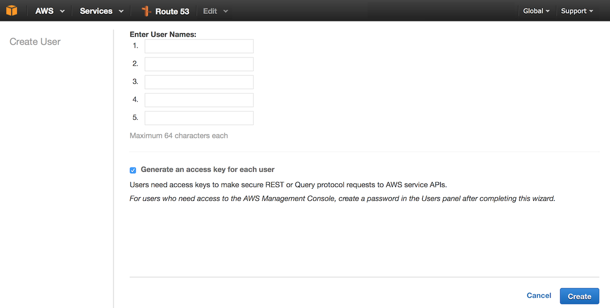
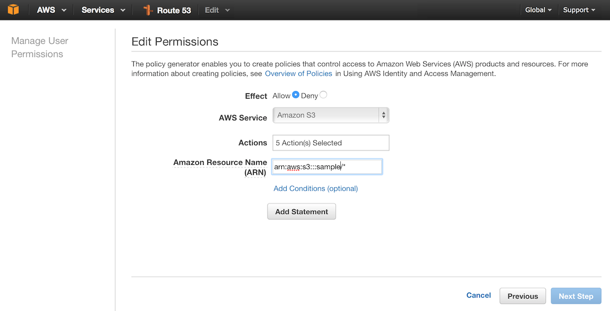

# Uploading direct to S3

If you are trying to build a lightweight image uploader on your server you have a lot of options. Using Paperclip, you can accomplish most things without much trouble. However, if you want to use a very small server plan you can clog up your server waiting on multiple uploads.

Instead you can directly upload to S3 (which is where you probably want to upload your images anyway) with a little bit of work. The nice thing is that you get free upload scalability, so in many ways it is worth the trouble.

Here is the rough outline of the steps:

1. Config
1. S3 config
1. upload_helper.rb
1. upload.js
1. using upload.js and waiting for processing
1. upload_controller.rb
1. ImageWorker
1. Specific Image Worker
1. ImageOptim 
1. Heroku custom buildpack
1. Cloudfront config

## Config

Allowing arbitrary uploads to your S3 bucket can be dangerous and expensive. Because of this, it is generally a good idea to limit uploads based on specific requests. AWS allows you to create a _signed_ upload url which can expire after a specific amount of time. In order to generate the url you'll need your API key and secret which you'll need to setup in your config (they remain on your server, you don't publish these keys).

This assumes you are running your development environment with a `.env` and a tool like foreman.

First, create a new API key in Amazon's AWS console for [IAM](https://console.aws.amazon.com/iam/home?region=us-east-1#users). You should not use your personal user credentials for the upload. In the event that either your account or the upload account are compromised you want to be able to reset them without impact. Try to segregate your upload users and keys by server or bucket or domain.

Go to [IAM](https://console.aws.amazon.com/iam/home?region=us-east-1#users), click on "Users", then click on "Create New Users"):

Enter the user name (something like `yourdomain-upload` or `yourbucket-upload`) and make sure you have checked the box to generate an access key for each user, then click "Create". You should see the new users created and be given the option to download the credentials which you should do. Click the "close" link.

You should be able to find your user in the created list of users. Click the user, then click "Attach Policy". You can find the policy "AmazonS3FullAccess", check the checkbox and click "Attach Policy". The policy is not very restrictive:

    {
      "Version": "2012-10-17",
      "Statement": [
        {
          "Effect": "Allow",
          "Action": "s3:*",
          "Resource": "*"
        }
      ]
    }

Using a less restrictive (default) policy may be okay, but if you want to lock down the security to a single bucket and specific actions, you can choose to generate an inline policy:

The actions you'll want to include are:

    "s3:GetObject",
    "s3:GetObjectAcl",
    "s3:ListBucket",
    "s3:PutObject",
    "s3:PutObjectAcl"

To grant the permissions only for a specific bucket, you need to specify the resource using an `arn`. An S3 bucket arn follows the format `arn:aws:s3:::yourbucket/*`

    {
        "Version": "2012-10-17",
        "Statement": [
            {
                "Effect": "Allow",
                "Action": [
                    "s3:GetObject",
                    "s3:GetObjectAcl",
                    "s3:ListBucket",
                    "s3:PutObject",
                    "s3:PutObjectAcl"
                ],
                "Resource": [
                    "arn:aws:s3:::yourbucket/*"
                ]
            }
        ]
    }

## S3 config

## upload_helper.rb
## upload.js
## using upload.js and waiting for processing
## upload_controller.rb
## ImageWorker
## Specific Image Worker
## ImageOptim 
## Heroku custom buildpack
## Cloudfront config