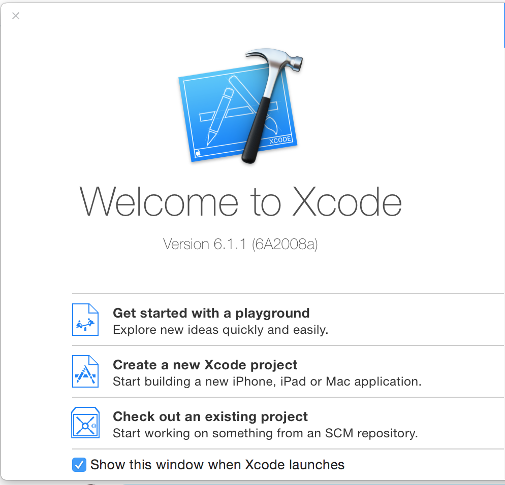
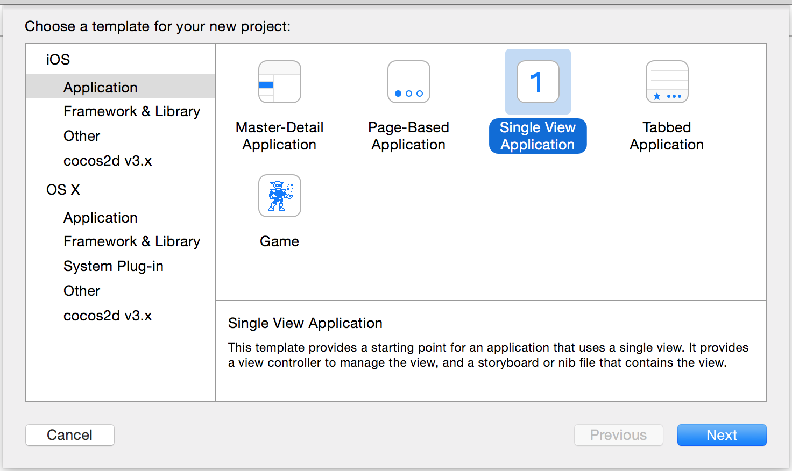
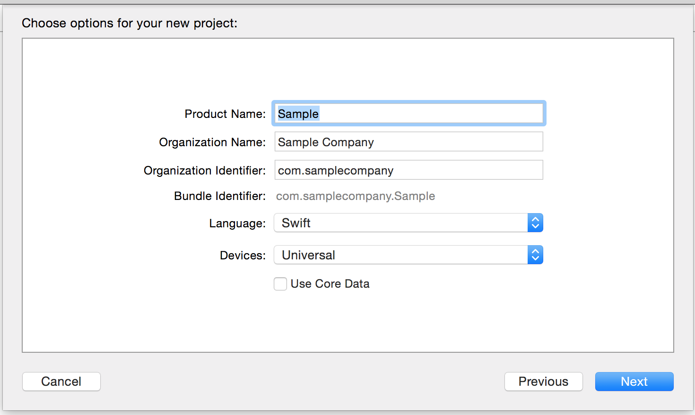

# Xcode and iOS

Create a new Xcode Project

When you create the project choose a _Single View Application_:

Setup the project options:

## Follow the Parse quick start guide

[https://www.parse.com/apps/quickstart#parse_data/mobile/ios/native/existing](https://www.parse.com/apps/quickstart#parse_data/mobile/ios/native/existing)

